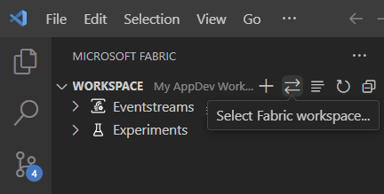
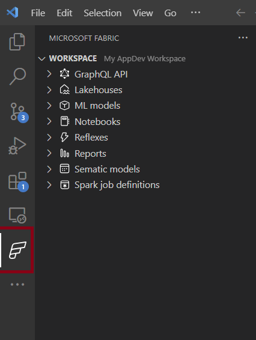

# Get started with Microsoft Fabric extension for VS Code
The Fabric Workspaces extension for VS Code allows you to view, manage a Fabric workspace within VS Code. The Fabric workspaces extension is the Core extension that enables Fabric App development extension to support additional feature to develop data function sets within your workspace.

## Sign in
When you open Microsoft Fabric extension in VS Code, you will see a sign in 

## Sign out 
You can sign out from the extension, by selecting **Accounts** and choose the user account using Fabric extension to sign out. 

## Create or select workspace 

You can change your workspace at anytime. Currently you can only view one workspace at a given time in VS Code. 

When changing the workspace, you can select existing workspace or create a new workspace. 

## Manage trusted extensions

You can manage which account can use Fabric extension using **Manage trusted extension** settings in VS Code. 

You can enable and remove extension for that user account. 

## Manage your workspace 

You can view all the artifacts in your selected workspace in VS Code. You can rename, delete your artifacts from VS code. 

